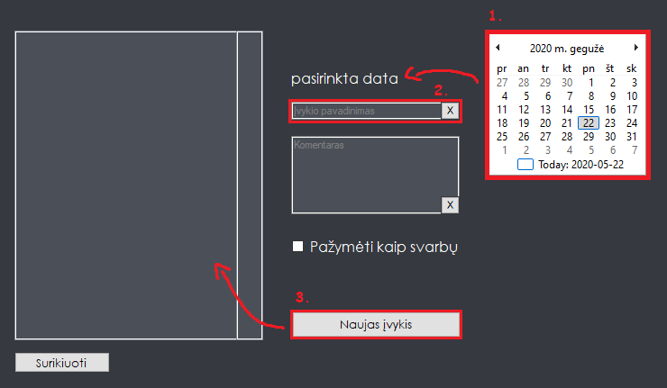
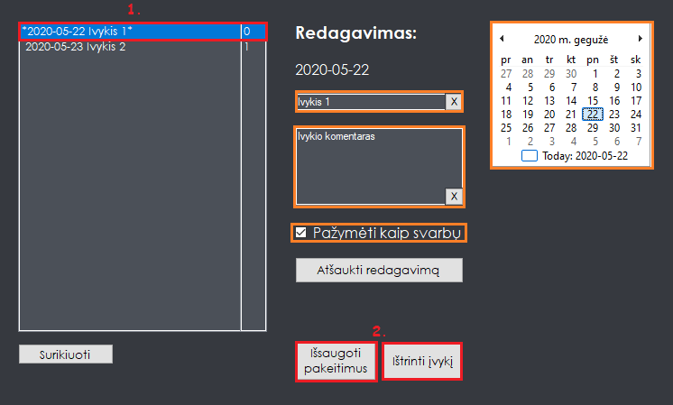

    <h1 align="center">Įvykių kalendorius</h1>

 ## Programa skirta registruoti įvykius kalendoriuje ir juos pavaizduoti ekrane.
  
___

    <h1 align="center">Naudojimas</h1>

Įvykio įrašymas:
1. Pasirinkite datą kalendoriuje
2. Įrašykite įvykio pavadinimą
3. Spauskite "Naujas įvykis" mygtuką

___

Įvykio redagavimas:
1. Pasirinkite įvykį iš sąrašo
2. Pakeiskite įvykio datą, pavadinimą, žymėjimą
3. Išsaugokite pakeitimus arba ištrinkite įvykį

___

Programos funkcijos:
- Registruoti vartotojus.
- Pasirinkti įvykio dieną ir laiką arba dienų intervalą.
- Įrašyti, redaguoti, trinti įvykius.
- Pažymėti, išskirti svarbius įvykius.
- Pateikti įvykius spausdinimui.
- Pasirinkti programos išvaizdos nustatymus.

___

### Programa buvo baigiamasis darbas JKM - Jaunųjų Kompiuterininkų Mokyklai C++ kursui
### 2020-05
